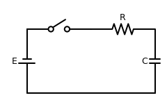

&ensp;
<!-- more -->
# 控制系统的时域数学模型
## 线性元部件、线性系统微分方程
1. 根据具体情况，确定系统或元部件的输入、输出变量；
2. 依据各元部件输入、输出变量所遵循的基本定律，列写微分方程组；
3. 消去中间变量，求出仅含输入、输出变量的系统微分方程；
4. 将微分方程整理成规范形式。

## 非线性系统微分方程的线性化
非线性微分方程求解相当困难，目前还缺少统一、通用的方法。但是通过某些近似简化或适当限制问题的研究范围，可将大部分非线性方程在一定范围内近似用用线性方程来代替。

## 线性定常微分方程求解
借助拉普拉斯可以将微分方程变换成复数域的代数方程。
例：R-C无源网络如图所示，试求开关闭合后电容电压的变化规律

根据基尔霍夫定律写电压平衡方程可得：
$$
RC\dot{u}_c(t)+u_c(t)=u_r(t)
$$
两端进行拉普拉斯变换
$$
RC[sU_c(s)-u_0]+U_c(s)=U_r(s)={E\over s}
$$
分解为部分分式
$$
U_c(s)={E\over{s(RCs+1)}}+{RCu_0\over{RCs+1}}={E\over s}-{E\over {s+{1\over{RC}}}}+{u_0\over{s+{1\over{RC}}}}
$$
将两端进行拉普拉斯反变换的
$$
u_c(t)=E(1-e^{-t\over{RC}})+u_0e^{-t\over{RC}}
$$
其中右端第一项是$u_r(t)$作用下的特解，称为零状态响应，第二项是$u_0$引起的其次解，称为零输入响应。
## 运动的模态
线性微分方程的解由其次方程的通解和输入信号对应的特解组成。通解反映系统自由运动的规律。如果微分方程的特征根是单实根$\lambda_1,\lambda_2,\cdots,\lambda_n$，则把函数$e^{\lambda_1t},e^{\lambda_2t},\cdots,e^{\lambda_nt},$称为该微分方程所描述运动的模态，也叫振型。
每一种模态可以看作线性系统自由响应中最基本的运动形态，线性系统的自由响应就是其模态的线性组合。

# 控制系统的复域数学模型
## 传递函数
传递函数是在零初始条件下，线性定常系统输出量的拉普拉斯变换与输入量拉普拉斯变换之比。

### 传递函数的性质
1. 具有复变函数的所有性质
2. 传递函数只取决于系统或元部件自身的结构参数，与外作用的形式和大小无关。
3. 传递函数与微分方程有直接联系。
4. 传递函数的拉普拉斯反变换即为系统的脉冲响应。

### 传递函数的局限性
1. 传递函数是零初始条件下定义的，因此它只反映系统在零状态下的动态特性，不能反映非零初始条件下系统的全部运动规律。
2. 传递函数通常只适合于描述单输入/单输出系统。
3. 传递函数是由拉普拉斯变换定义的，只适用于线性定常系统

### 常用控制元件的传递函数
1. 电位计：$G(s)=K$
2. 误差检测器：$G(s)=K$
3. 自整角机：$G(s)=K$
4. 测速发电机：$G(s)=K或G(s)=Ks$
5. 电枢控制直流电动机：$G(s)={K\over{T_ms+1}}或G(s)={K\over{s(T_ms+1)}}$
6. 两项异步电机：$G(s)={K\over{s(T_ms+1)}}$
7. 齿轮：$G(s)={1\over i}$

### 典型环节
$$
\begin{array}{c|c|c|c}
    \hline
    \text{序号}&\text{环节名称}&\text{微分方程}&\text{传递函数}\\
    \hline
    1&\text{比例环节}&c=K\cdot r&K\\
    \hline
    2&\text{惯性环节}&T\dot{c}+c=r&{1\over{Ts+1}}\\
    \hline
    3&\text{振荡环节}&T^2\ddot{c}+2\xi T\dot{c}=r(0<\xi<1)&{1\over{T^2s^2+2\xi Ts+1}}\\
    \hline
    4&\text{积分环节}&\dot{c}=r&{1\over s}\\
    \hline
    5&\text{微分环节}&c=\dot{r}&s\\
    \hline
    6&\text{一阶复合}\\&\text{微分环节}&c=\tau\dot{r}+r&\tau s+1\\
    \hline
    7&\text{二阶复合}\\&\text{微分环节}&c=\tau^2\ddot{r}+2\tau\xi r+r&\tau^2 s^2+2\xi\tau s+1
\end{array}
$$

