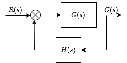

&ensp;
<!-- more -->

# 根轨迹的基本概念
根轨迹是当开环系统某一参数从零到无穷大变化时，闭环特征方程的根在s平面上移动轨迹。
根轨迹增益是首一形式开环传递函数对应的系数。
为了进一步了解根轨迹，可以先假设一个系统如图所示

其开环传递函数为$G(s)=\displaystyle{K\over s(0.5s+1)}={K^*\over s(s+2)}$。
闭环传递函数为$G(s)=\displaystyle{K^*\over s^2+2s+K^*}$。
由此可以得到特征根为$\lambda_{1,2}=-1\pm\sqrt{1-K^*}$。

当参数从零到无穷大变化时，闭环极点变化如图所示

## 根轨迹与系统性能
### 稳定性
开环增益从零到无穷大变化时，如图2所示，根轨迹全部落在左半s平面，因此当K>0时，系统是稳定的。
如果根轨迹越过虚轴进入右半平面，则在相应K值下，系统是不稳定的。根轨迹与虚轴交点处的K值，就是临界开环增益。

### 稳态性能

由图2可见，开环系统在坐标原点有一个极点，系统属于$\rm I$型系统。因而根轨迹上的K值就等于静态速度误差系数K

### 动态性能
由图2可见，当$0< K< 0.5$时，闭环特征根为实根，系统呈现过阻尼状态。
当$K=0.5$时，闭环特征根是二重实根，系统呈现临界阻尼状态。
当$K>0.5$时，闭环特征根为一对共轭复根，系统呈现欠阻尼状态，且随着K增大，阻尼比减小，超调量增加，调节时间基本不变。

## 闭环零极点与开环零极点的关系

控制系统一般结构如图3所示，相应开环传递函数为$G(s)H(s)$

图3 一般结构图

设
$$
G(s)={\displaystyle K^*_G\prod_{i=1}^f(s-z_i)\over\displaystyle \prod_{j=1}^g(s-p_j)}\\
G(s)H(s)={\displaystyle K^*\prod_{i=1}^m(s-z_i)\over\displaystyle \prod_{j=1}^n(s-p_j)}
$$

那么就有闭环传递函数为
$$
\Phi(s)={G(s)\over 1+G(s)H(s)}=
{\displaystyle K^*_G\prod_{i=1}^f(s-z_i)\displaystyle \prod_{j=g+1}^n(s-p_j)\over\displaystyle \prod_{j=1}^n(s-p_j)+\displaystyle K^*\prod_{i=1}^m(s-z_i)}
$$

闭环零点由前向通路传递函数$G(s)$的零点和反馈通路传递函数$H(s)$的极点组成，对于单位反馈系统来说，闭环零点就是开环零点。

闭环极点与开环零极点以及根轨迹增益$K^*$均有关系。
根轨迹的任务在于，由已知的开环零极点分布以及根轨迹增益，通过图解法找出闭环极点。一旦闭环极点确认，再补上闭环零点，系统性能便可以确认。

## 根轨迹方程
闭环系统可由图3描述，系统的开环传递函数一般为

$$
G(s)H(s)={\displaystyle K^*\prod_{i=1}^m(s-z_i)\over\displaystyle \prod_{j=1}^n(s-p_j)}
$$
系统的闭环传递函数一般为
$$
\Phi(s)={G(s)\over 1+G(s)H(s)}
$$
系统的闭环特征方程为
$$
1+G(s)H(s)=0
$$
则有根轨迹方程为
$$
G(s)H(s)={\displaystyle K^*\prod_{i=1}^m(s-z_i)\over\displaystyle \prod_{j=1}^n(s-p_j)}=-1
$$

上式可以用幅值条件和相角条件表示
幅值条件为
$$
|G(s)H(s)|=K^*{\displaystyle\prod_{i=1}^m|s-z_i|\over\displaystyle\prod_{j=1}^n|s-p_j|}=1
$$

相角条件
$$
\angle G(s)H(s)=\sum_{i=1}^m\angle(s-z_i)-
\sum_{j=1}^n\angle(s-p_j)\\
=\sum_{i=1}^m\varphi_i-\sum_{j=1}^n\theta_j=(2k+1)\pi\\
其中k=0,\pm1,\pm2,\cdots
$$

从上式可以看出，幅值条件与根轨迹增益有关，而相角条件与根轨迹增益无关，所以s平面上某个点，只要满足相角条件，则该点必在根轨迹上。至于根轨迹增益，可由幅值条件得出。

这意味着，在s平面上满足相角条件必定也满足幅值条件，因此相角条件是确定s平面上一点是否存在根轨迹的充要条件。

# 绘制根轨迹的基本法则

