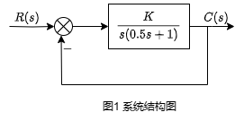
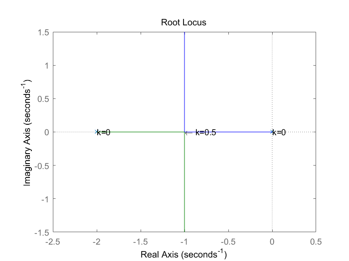

&ensp;
<!-- more -->

# 根轨迹的基本概念
根轨迹是当开环系统某一参数从零到无穷大变化时，闭环特征方程的根在s平面上移动轨迹。
根轨迹增益是首一形式开环传递函数对应的系数。
为了进一步了解根轨迹，可以先假设一个系统如图所示

其开环传递函数为$G(s)=\displaystyle{K\over s(0.5s+1)}={K^*\over s(s+2)}$。
闭环传递函数为$G(s)=\displaystyle{K^*\over s^2+2s+K^*}$。
由此可以得到特征根为$\lambda_{1,2}=-1\pm\sqrt{1-K^*}$。

当参数从零到无穷大变化时，闭环极点变化如图所示

## 根轨迹与系统性能
### 稳定性
开环增益从零到无穷大变化时，如图2所示，根轨迹全部落在左半s平面，因此当K>0时，系统是稳定的。
如果根轨迹越过虚轴进入右半平面，则在相应K值下，系统是不稳定的。根轨迹与虚轴交点处的K值，就是临界开环增益。

### 稳态性能

由图2可见，开环系统在坐标原点有一个极点，系统属于$\rm I$型系统。因而根轨迹上的K值就等于静态速度误差系数K

### 动态性能
由图2可见，当$0< K< 0.5$时，闭环特征根为实根，系统呈现过阻尼状态。
当$K=0.5$时，闭环特征根是二重实根，系统呈现临界阻尼状态。
当$K>0.5$时，闭环特征根为一对共轭复根，系统呈现欠阻尼状态，且随着K增大，阻尼比减小，超调量增加，调节时间基本不变。

## 闭环零极点与开环零极点的关系

控制系统一般结构如图3所示，相应开环传递函数为$G(s)H(s)$

图3 一般结构图

设
$$
G(s)={\displaystyle K^*_G\prod_{i=1}^f(s-z_i)\over\displaystyle \prod_{j=1}^g(s-p_j)}\\
G(s)H(s)={\displaystyle K^*\prod_{i=1}^m(s-z_i)\over\displaystyle \prod_{j=1}^n(s-p_j)}
$$

那么就有闭环传递函数为
$$
\Phi(s)={G(s)\over 1+G(s)H(s)}=
{\displaystyle K^*_G\prod_{i=1}^f(s-z_i)\displaystyle \prod_{j=g+1}^n(s-p_j)\over\displaystyle \prod_{j=1}^n(s-p_j)+\displaystyle K^*\prod_{i=1}^m(s-z_i)}
$$

闭环零点由前向通路传递函数$G(s)$的零点和反馈通路传递函数$H(s)$的极点组成，对于单位反馈系统来说，闭环零点就是开环零点。

闭环极点与开环零极点以及根轨迹增益$K^*$均有关系。
根轨迹的任务在于，由已知的开环零极点分布以及根轨迹增益，通过图解法找出闭环极点。一旦闭环极点确认，再补上闭环零点，系统性能便可以确认。

## 根轨迹方程
闭环系统可由图3描述，系统的开环传递函数一般为

$$
G(s)H(s)={\displaystyle K^*\prod_{i=1}^m(s-z_i)\over\displaystyle \prod_{j=1}^n(s-p_j)}
$$
系统的闭环传递函数一般为
$$
\Phi(s)={G(s)\over 1+G(s)H(s)}
$$
系统的闭环特征方程为
$$
1+G(s)H(s)=0
$$
则有根轨迹方程为
$$
G(s)H(s)={\displaystyle K^*\prod_{i=1}^m(s-z_i)\over\displaystyle \prod_{j=1}^n(s-p_j)}=-1
$$

上式可以用幅值条件和相角条件表示
幅值条件为
$$
|G(s)H(s)|=K^*{\displaystyle\prod_{i=1}^m|s-z_i|\over\displaystyle\prod_{j=1}^n|s-p_j|}=1
$$

相角条件
$$
\angle G(s)H(s)=\sum_{i=1}^m\angle(s-z_i)-
\sum_{j=1}^n\angle(s-p_j)\\
=\sum_{i=1}^m\varphi_i-\sum_{j=1}^n\theta_j=(2k+1)\pi\\
其中k=0,\pm1,\pm2,\cdots
$$

从上式可以看出，幅值条件与根轨迹增益有关，而相角条件与根轨迹增益无关，所以s平面上某个点，只要满足相角条件，则该点必在根轨迹上。至于根轨迹增益，可由幅值条件得出。

这意味着，在s平面上满足相角条件必定也满足幅值条件，因此相角条件是确定s平面上一点是否存在根轨迹的充要条件。

# 绘制根轨迹的基本法则

## 法则1
根轨迹的起点和终点：根轨迹起始于开环极点，终于开环零点。如果少于极点个数，则有$(n-m)$条根轨迹终止于无穷远。
将幅值条件改写成如下形式
$$
K^*={\displaystyle\prod_{j=1}^n|s-p_j|\over\displaystyle\prod_{i=1}^n|s-z_i|}=
{\displaystyle s^{n-m}\prod_{j=1}^n|1-{p_j\over s}|\over\displaystyle\prod_{i=1}^n|1-{z_i\over s}|}
$$

可以看出，当$K^*=0$时，$s=z_i$，当$K^*\to\infty$时，$s=z_i$，即根轨迹起始于开环极点终于开环零点。
当$|s|\to\infty,n>m$时，$K^*\to\infty$即如果少于极点个数，则有$(n-m)$条根轨迹终止于无穷远。

## 法则2
根轨迹的分支数，对称性和连续性，根轨迹的分支数与开环零点开环极点的大者，根轨迹连续且对称于实轴。

实际系统的特征方程都是实系数方程，其特征根必定为实数或者共轭复数，因此根轨迹必定对称于实轴。

特征方程的某些系数是根轨迹增益的函数，根轨迹增益从零连续变化到无穷大时，特征方程系数是连续变化的，因而特征根变化必定连续。

## 法则3

实轴上的根轨迹：实轴上某一趋于，其右边开环零极点个数之和为奇数，则该区域必定为根轨迹。

由相角条件可知，某一点$s_0$在根轨迹上，开环零点到该店的角度之和减去开环极点到该点的角度之和为$(2k+1)\pi$，而在该点的左边实轴上的开环零极点到该点的角度为0，因此对角度不造成影响。而在该点右边的开环零极点到该点的角度为$\pi$。
因此，若其右边开环零极点个数之和为奇数，则该区域必定为根轨迹。
而实轴之外的点必定是共轭根，因此可以不作考虑。

## 法则4

根轨迹的渐进性，当系统开环极点个数大于开环零点，有n-m条根轨迹沿着实轴夹角$\varphi_a$，交点为$\sigma_a$的一组渐近线趋向无穷。且有
$$
\begin{cases}
    \varphi_a={\displaystyle{(2k+1)\pi\over n-m}}\\
    \sigma_a={\displaystyle{\sum_{j=1}^n p_j-\sum_{i=1}^m z_i \over n-m}}
\end{cases}
$$

设无穷远处有一闭环极点$s^*$，则s平面上所有从开环零点和极点指向$s^*$的角度都相等，带入相角条件可得
$$
m\varphi_a-n\varphi_a=(2k+1)\pi\\
\therefore\varphi_a={(2k+1)\pi\over n-m}
$$

而渐近线和实轴的交点$\sigma_a$可以通过模值条件求得，因为$s^*$在无穷远处，因此可以认为所有开环零极点到该点长度相等，因此可以认为所有开环零极点都汇集到一点上，该点为$\sigma_a$
即为
$$
{\displaystyle\prod_{j=1}^n(s-p_j)\over
\displaystyle\prod_{i=1}^m(s-z_i)}
=(s-\sigma_a)^{n-m}=-K^*
$$

将上式右端展开得
$$
(s-\sigma_a)^{n-m}=s^{n-m}-(\sum_{j=1}^np_j-\sum_{i=1}^mz_i)s^{n-m-1}+\cdots
$$
当$s\to\infty$时，比较第二项系数可得
$$
\sigma_a={\displaystyle\sum_{j=1}^np_j-\sum_{i=1}^mz_i\over n-m}
$$

## 法则5
根轨迹的分离点：两条或两条以上根轨迹在s平面上相遇又分离的点称为分离点，分离点的坐标d是方程
$$
\sum_{j=1}^n{1\over d-p_j}=\sum_{i=1}^m{1\over d-z_i}
$$

由根轨迹方程有
$$
1+{k^*\displaystyle\prod_{i=1}^m(s-z_i)\over
\displaystyle\prod_{j=1}^n(s-p_j)}=0
$$

所以闭环特征方程为
$$
D(s)=\displaystyle\prod_{j=1}^n(s-p_j)+K^*\displaystyle\prod_{i=1}^m(s-z_i)=0
$$

根轨迹在s平面相遇，说明闭环特征方程有重根，设重根为$d$，根据代数中重根条件
$$
D'(s)={d\over ds}[\prod_{j=1}^n(s-p_j)+K^*\prod_{i=1}^m(s-z_i)]=0
$$

将式子两端对应相除得
$$
{  \displaystyle{d\over ds}\prod_{j=1}^n(s-p_j)\over \displaystyle\prod_{j=1}^n(s-p_j)}=
{  \displaystyle{d\over ds}\prod_{i=1}^m(s-z_i)\over \displaystyle\prod_{i=1}^m(s-z_i)}\\
{d\ln\displaystyle\prod_{j=1}^n(s-p_j)\over ds}=
{d\ln\displaystyle\prod_{i=1}^m(s-z_i)\over ds}\\
\sum_{j=1}^n{d\ln(s-p_j)\over ds}=
\sum_{i=1}^m{d\ln(s-z_i)\over ds}\\
\sum_{j=1}^n{1\over s-p_j}=\sum_{i=1}^m{1\over s-z_i}
$$

## 法则6
根轨迹与虚轴的交点，若根轨迹与虚轴有交点，意味着闭环特征方程出现纯虚根可令$s=jw$，然后分别令实部和虚部均为0，从中求的$K^*$。

## 法则7
起始角和终止角，根轨迹离开开环极点的切线与正实轴的夹角，称为起始角，以$\theta_{P_i}$，根轨迹进入开环零点处的切线与正实数的夹角，称为终止角，以$\varphi_{z_i}$表示。

假设求解s到某一点$p_i$的起始角，那么s到$p_i$的距离无限小，则$\overrightharpoon{p_2s}$的相角即为起始角。
除去$p_i$之外，其余零极点指向s与指向$p_2$的向量等价。则由相角条件可得
$$
\sum_{i=1}^m\varphi_i-\sum_{j=1}^n\theta_j=(2k+1)\pi
$$
终止角也类似。

## 法则8 
根之和，当系统开环传递函数的分子、分母阶次差$(n-m)$大于等于2，系统闭环极点之和等于系统开环极点之和。即
$$
\sum_{i=1}^n\lambda_i=\sum_{i=1}^np_i
$$

设系统开环传递函数为
$$
G(s)H(s)={K^*(s-z_1)(s-z_2)\cdots(s-z_m)\over(s-p_1)(s-p_2)\cdots(s-p_n)}
$$
则有闭环特征式
$$
\begin{aligned}
D(s)&=K^*(s-z_1)(s-z_2)\cdots(s-z_m)+(s-p_1)(s-p_2)\cdots(s-p_n)\\
&=s^n+\sum_{i=1}^n -p_is^{n-1}+\cdots\\
&=(s-\lambda_1)(s-\lambda_2)\cdots(s-\lambda_n)\\
&=s^n+\sum_{i=1}^n -\lambda_i s^{n-1}+\cdots
\end{aligned}
$$

当$n-m\geqslant2$时，特征方程第二项系数与$K^*$无关。
上式表明若一部分极点总体向右移动，则另一部分极点必然总体上向左移动，且左右移动量总体为0

# 广义根轨迹
## 参数根轨迹
除去根轨迹增益$K^*$以外的其他参数从零到无穷大变化绘制的根轨迹图像称为根轨迹参数。
绘制参数根轨迹法则与绘制常规根轨迹法则完全相同，只需要绘制参数根轨迹之前引入等效开环传递函数。下面举例说明:
设单位反馈系统 开环传递函数为
$$
G(s)={ {1\over4}(s+a)\over s^2(s+1)}
$$
则系统的闭环特征方程为
$$
D(s)=s^3+s^2+{1\over4}s+{1\over 4}a=0
$$
由此构造等效开环传递函数
$$
G^*(s)={ {1\over 4}a\over s(s^2+s+{1\over 4})}
$$
再根据等效开环传递函数绘制根轨迹即可。

## 零度根轨迹
在负反馈调节下，系统的根轨迹方程为$G(s)H(s)=-1$，相角条件$\angle G(s)H(s)=(2k+1)\pi$。
当系统处于正反馈状态时，系统的根轨迹方程为$G(s)H(s)=1$，相角条件$\angle G(s)H(s)=2k\pi$。

由此，只需改变法则3、法则4、法则7即可，修改后为
### 法则3
实轴上的根轨迹，若其右边零极点个数之和为偶数，则该区域必定为根轨迹。

### 法则4
根轨迹的渐近线与实轴夹角为
$$
\varphi_a={2k\pi\over n-m}\qquad(k=0,\pm1,\cdots)
$$

### 法则7
根轨迹的起始角和终止角的计算为
$$
\sum_{i=1}^m\varphi_i-\sum_{j=1}^n\theta_j=2k\pi
$$

# 利用根轨迹分析系统性能
## 利用闭环主导极点估算系统性能
如果高阶闭环极点满足具有闭环主导鸡蛋的分布规律，就可以忽略主导极点及偶极子的影响。把高阶系统简化成阶数比较低的系统。
若单位负反馈系统的开环传递函数为

$$
G(s)={K\over s(s+1)(0.5s+1)}
$$

将开环传递函数写成零极点形式
$$
G(s)={K^*\over s(s+1)(s+2)}
$$
实轴上的根轨迹区段为$(-\infty,-2],[-1,0]$

渐近线
$$
\begin{cases}
\sigma_a={-1-2\over 3}=-1\\
\varphi_a={(2k+1)\pi\over3}=\pm{\pi\over3},\pi
\end{cases}
$$

分离点
$$
{1\over d}+{1\over d+1}+{1\over d+2}=0\\
$$

即: $\quad 3d^2+6d+2=0$

解得$d_1=-1.577,d_2=-0.432$

与虚轴的交点，闭环特征方程式为
$$
D(s)=s^3+3s^2+2s+K^*=0
$$
则有
$$
\begin{cases}
Re[D(jw)]=-3w^2+k^*=0\\
Im[D(jw)]=-w^3+2w=0
\end{cases}
$$
解得$w=\pm\sqrt{2},K^*=6$
系统根轨迹图如图所示
afdasfd
\\

adsfsadf

asdf

saf

为了确认满足阻尼比$\zeta=0.5$时，系统的三个闭环极点，可设相应两个复数闭环极点
$$
\lambda_1=-\zeta\omega_n+j\omega_n\sqrt{1-\zeta^2}=-0.5\omega_n+j0.866\omega_n\\
\lambda_2=-\zeta\omega_n+j\omega_n\sqrt{1-\zeta^2}=-0.5\omega_n-j0.866\omega_n
$$

闭环特征方程为
$$
D(s)=(s-\lambda_1)(s-\lambda_2)(s-\lambda_3)\\
=s^3+3s^2+2s+K^*
$$

比较系数可得
$$
\begin{cases}
\omega_n-\lambda_3=3\\
\omega_n^2-\lambda_3\omega_n=2\\
-\lambda_3\omega_n^2=K^*
\end{cases}
$$
解得$\omega_n={2\over3},\lambda_3=-2.33,K^*=1.04$

则闭环极点为
$$
\lambda_1=-0.33+j0.58,\lambda_2=-0.33-j0.58,\lambda_3=-2.33
$$
在所求得得三个闭环极点中，$\lambda_3$至虚轴的距离与$\lambda_1$到虚轴的距离之比为${\displaystyle2.34\over \displaystyle0.33}\approx7$，因此$\lambda_1,\lambda_2$是系统的主导极点。
原系统闭环增益为1，因此相应的二阶系统闭环传递函数为
$$
\Phi_2(s)={0.667^2\over s^2+0.667s+0.667^2}
$$

带入公式可得
$$
\sigma\%=e^{-\zeta\pi/\sqrt{1-\zeta^2}}=16.3\%\\
t_s={3.5\over \zeta\omega_n}=10.5
$$
原系统为$\rm I$型系统，系统的静态速度误差系数为
$$
K_v=\lim\limits_{s\to0}s{K\over s(s+1)(0.5s+1)}=K
$$

$$
(s-\sigma_a)^{n-m}=s^{n-m}-\sigma_a(n-m)s^{n-m-1}+\cdots
$$
左端用长除法处理为
$$
{\displaystyle\prod_{j=1}^n(s-p_j)\over\displaystyle\prod_{i=1}^m(s-z_i)}
=s^{n-m}-(\sum_{j=1}^np_j-\sum_{i=1}^mz_i)s^{n-m-1}+\cdots
$$
当$s\to\infty$，只保留前两项，并比较第二项系数可得
$$
\sigma_a={\displaystyle\sum_{j=1}^np_j-\sum_{i=1}^mz_i\over n-m}
$$

## 法则5
根轨迹得分离点：两条或两条以上根轨迹分支在s平面上相遇又分离的点，称为根轨迹的分离点，分离点的坐标d是方程
$$
\sum_{j=1}^n{1\over d-p_j}=\sum_{i=1}^m{1\over d-z_i}
$$

由根轨迹方程式有
$$
1+{K^*\displaystyle\prod_{i=1}^m(s-z_i)\over\displaystyle\prod_{j=1}^n(s-p_j)}=0\\
\therefore\prod_{j=1}^n(s-p_j)+K^*\prod_{i=1}^m(s-z_i)=0
$$

