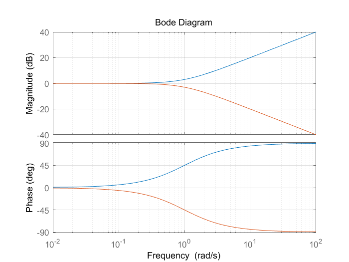
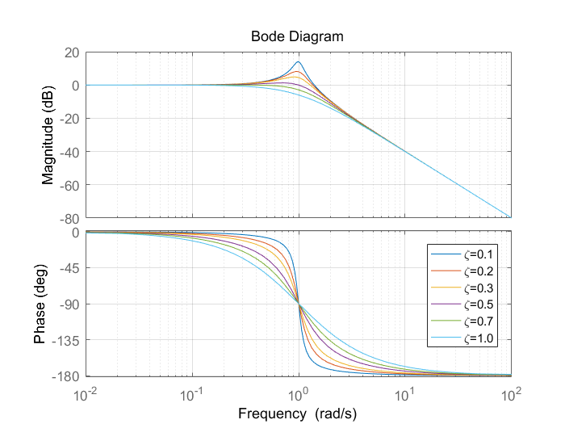
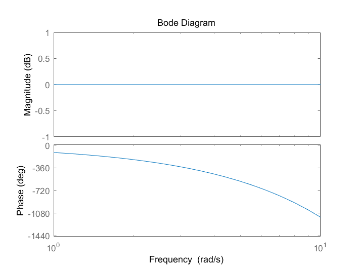

&ensp;
<!-- more -->

# 频率特性的基本概念
## 频率响应

线性控制系统在输入正弦信号，其稳态输出随频率变化的规律，称为该系统的频率响应。
系统的传递函数可以表示为
$$
G(s)={C(s)\over R(s)}={M(s)\over(s+p_1)(s+p_2)\cdots(s+p_n)}
$$

其中$M(s)$表示$G(s)$ 的分子多项式，当输入信号$r(t)=X\sin wt$时，有
$$
R(s)={Xw\over s^2+w^2}
$$
那么，输出信号就为
$$
C(s)={C(s)\over R(s)}={M(s)\over(s+p_1)(s+p_2)\cdots(s+p_n)}{Xw\over (s+jw)(s-jw)}\\
={C_1\over s+p_1}+{C_2\over s+p_2}+\cdots+{C_n\over s+p_n}+{C_a\over s+jw}+{C_{-a}\over s-jw}
$$


输出信号的反拉普拉斯变化得
$$
c(t)=C_1e^{-p_1t}+C_2e^{-p_2t}+\cdots+C_ne^{-p_nt}+
C_ae^{-jwt}+C_{-a}e^{-jwt}
$$

假设系统稳定，上式除了最后两项以外，其余各项都将衰减至0。所以稳态分量为
$$
c_s(t)=C_ae^{jwt}+C_{-a}e^{-jwt}
$$

其中，系数可如下计算
$$
C_a=G(s){Xw\over (s+jw)(s-jw)}(s-jw){\huge |}_{s=jw}
={XG(jw)\over 2j}\\
C_{-a}=G(s){Xw\over (s+jw)(s-jw)}(s+jw){\huge |}_{s=-jw}
=-{XG(-jw)\over 2j}
$$

其中$G(jw)$是复函数，可写为
$$
G(jw)=|G(jw)|e^{j\angle G(jw)}
$$

则有
$$
c_s(t)=X{|G(jw)|\over 2j}[e^{jwt}e^{j\angle G(jw)}-e^{-jwt}e^{j\angle G(-jw)}]\\
=X|G(jw)|\sin[wt+\angle G(jw)]
$$

上式表明线性系统在输入正弦信号时，其稳态输出是与输入同频率的正弦信号，输出正弦信号与输入正弦信号幅值比为$G(jw)$，相角差为$G(jw)$的相角。

## 频率特性
线性定常系统的频率特性定义为系统的稳态正弦响应与输入正弦信号的复数比用$G(jw)$表示
$$
\begin{aligned}
G(jw)&={X|G(jw)|e^{j\angle G(jw)}\over Xe^{j0}}\\
&=|G(jw)|e^{j\angle G(jw)}\\
&=A(w)\angle \varphi(w)
\end{aligned}
$$

频率特性描述了在不同频率下系统传递正弦信号的能力。
可以看出，将s替换jw就可以得到相应的频率特性。尽管频率特性是一种稳态响应，但系统动态过程的规律也全部在其中。
因此，频率特性也能表征系统的运动规律。

有关频率特性推导是在系统稳定得条件下给出的。若系统不稳定，输出响应最终不可能达到稳态过程。
但从理论上讲$c(t)$中的稳态分量$c_s(t)$总是可以被分解出来，所以频率特性的概念同样**适合于**不稳定系统。


## 频率特性图形表示方法

### 频率特性曲线
频率特性曲线包括幅频特性曲线和相频特性曲线。幅频特性是频率特性幅值$|G(jw)|$随$w$的变化规律；相频特性是频率特性相角$\angle G(jw)$随$w$变化规律。

下图是闭环传递函数$\Phi(s)=\displaystyle{1\over Ts+1}$的频率特性曲线图：


<center>图1 频率特性曲线</center>


### 幅相特性曲线
幅相特性曲线又称为奈奎斯特图，在平面上以极坐标的形式表示。向量的长度为$A(w_i)$，相角为$\varphi(w_i)$。
下图是闭环传递函数$\Phi(s)=\displaystyle{1\over Ts+1}$的幅相特性曲线图：


<center>图2 幅相特性曲线</center>

### 对数频率特性曲线
对数频率特性曲线又叫伯德图，由对数幅频特性和对数相频两条曲线所组成，其横坐标采用对数刻度，纵坐标采用均匀刻度。

在伯德图中，对数频率特性是$G(jw)$的对数值$20\lg|G(jw)|$与频率$w$的关系曲线。

对数频率特性曲线必须注意对数刻度特点，坐标轴两点$w_1,w_2$之间的距离是$\lg w_1-\lg w_2$，横坐标上两对频率间距离相同，则其比值相等。

频率每变化10倍称为一个十倍频程，又称“旬距”，记作dec。

对数幅频特性的纵坐标为$L(w)=20\lg A(w)$，称为对数幅值，单位是dB。$A(w)$的幅值每增大10倍，对数幅频$L(w)$就增加20dB。

下图是闭环传递函数$\Phi(s)={1\over Ts+1}$的对数频率特性曲线图：


<center>图3 对数频率特性曲线</center>


采用对数坐标图的优点较多，主要表现在下述几个方面：
1. 由于横坐标采用对数刻度，相对展宽了低频段，相对压缩了高频段。因此可以在较宽的频段范围中研究系统的频率特性。
2. 对数将乘除变为加减，可将多个环节的串联而成的系统的各个环节的对数幅频特性叠加即可得到该系统的对数幅相特性曲线。
3. 在对数坐标图上，所有典型环节的对数幅频特性乃至系统的对数幅频特性均可以用分段直线近似表示。若对分段直线进行修正，即可得到精确的特性曲线。
4. 若将实现所得的频率特性数据整理，并用分段直线画出对数频率特性，很容易写出实验对象的频率特性表达式或传递函数。

### 对数幅相特性曲线
对数幅相特性曲线又称尼科尔斯图。

对数幅相特性是由对数幅频特性和对数相频特性合并而成的曲线。对数幅相坐标的横轴为相角$\varphi(w)$单位是$(^{\circ})$，纵轴为对数幅频值$L(w)=20\lg A(w)$，单位是dB。

下图是闭环传递函数$\Phi(s)=\displaystyle{1\over Ts+1}$的对数幅频特性曲线图：


<center>图4 对数幅相特性曲线</center>


采用对数幅相特性可以用尼科尔斯图线方便地求得系统的闭环特性以及有关的特性参数。

# 幅相频率特性
## 典型环节的幅相特性曲线
### 比例环节
比例环节的传递函数为$G(s)=K$。
其频率特性为
$$
G(jw)=K+j0=Ke^{j0}\\
\begin{cases}
A(w)&=|G(jw)|=K\\
\varphi(w)&=\angle G(jw)=0^{\circ}
\end{cases}
$$
比例环节的幅相特性是G平面上实轴的一个点，如图所示，它表明比例环节稳态正弦响应的振幅是输入信号的K倍，且响应与输入同相角。


<center>图5 比例环节幅相特性曲线</center>


### 微分环节
微分环节的传递函数为$G(s)=s$。
其频率特性为
$$
G(jw)=0+jw=we^{j90^\circ}\\
\begin{cases}
A(w)&=w\\
\varphi(w)&= 90^{\circ}
\end{cases}
$$

微分环节的幅值与w成正比，相角恒为$90^\circ$。其幅相特性曲线如图所示：


<center>图6 微分环节幅相特性曲线</center>

### 积分环节
积分环节的传递函数为$G(s)=\displaystyle{1\over s}$。

其频率特性为
$$
G(jw)=0+{1\over jw}={1\over w}e^{-j90^\circ}\\
\begin{cases}
A(w)&=\displaystyle{1\over w} \\
\varphi(w)&=- 90^{\circ}
\end{cases}
$$

积分环节的幅值与w成反比，相角恒为$-90^\circ$，其幅相特性曲线如图所示：


<center>图5 积分环节幅相特性曲线</center>

### 惯性环节
积分环节的传递函数为$G(s)=\displaystyle{1\over Ts+1}$。

其频率特性为
$$
G(jw)={1\over 1+Tjw}={1\over \sqrt{1+T^2w^2}}e^{-j\arctan Tw}\\
\begin{cases}
A(w)&=\displaystyle{1\over \sqrt{1+T^2w^2}} \\
\varphi(w)&=- \arctan Tw
\end{cases}
$$

惯性环节幅相特性曲线是一个以点（1/2，j0），为圆心、半径为1/2的半圆，
证明如下：
$$
G(jw)={1\over 1+jTw}=X+jY \tag{1}
$$
其中

$$
X={1\over 1+T^2w^2}\\
Y={-Tw\over 1+T^2w^2}=TwX
$$
由此可得
$$
-Tw={Y\over X}\tag{2}
$$
将上式带回1式，可得
$$
(X-{1\over 2})^2+Y^2=({1\over 2})^2
$$

从式2可以看出，当x为正时，y只能为负，这意味着曲线在实轴的下方。其幅相特性曲线如图所示：


<center>图6 惯性环节幅相特性曲线</center>

若某环节的的传递函数为$G(s)=\displaystyle{10\over Ts+1}$，当w=1的正弦信号时，该环节稳态响应的相角滞后$30^\circ$，试确定该环节的传递函数。

由传递函数可得频率传递函数为$G(jw)=\displaystyle{10\over Tj+1}$，则有$A(1)=\displaystyle{10\sqrt{3}\over3},\varphi(1)=-\arctan T=-30^\circ$。
则有$T={\sqrt{3}\over3}$，所以
$$
G(s)={10\over\displaystyle{\sqrt{3}\over3}s+1}
$$

由此可以看出惯性环节是一种低通滤通器，低频信号容易通过，而高频信号通过后幅值衰减较大。


对于不稳定的惯性环节，其传递函数为$G(s)=\displaystyle{1\over Ts-1}$。

其频率特性为
$$
G(jw)={1\over -1+Tjw}={1\over \sqrt{1+T^2w^2}}e^{-j\arctan Tw}\\
\begin{cases}
A(w)&=\displaystyle{1\over \sqrt{1+T^2w^2}} \\
\varphi(w)&=-180^\circ + \arctan Tw
\end{cases}
$$
可以看出其幅相特性曲线与稳定的惯性环节的幅相特性曲线关于纵坐标轴对称，其幅相特性曲线如下：


<center>图7 不稳定惯性环节幅相特性曲线</center>

### 一阶复合微分环节
一阶复合微分环节的传递函数为$G(s)=1+Ts$。

其频率特性为
$$
G(jw)=1+jTw=\sqrt{1+T^2w^2}e^{j\arctan Tw}\\
\begin{cases}
A(w)&=\displaystyle{\sqrt{1+T^2w^2}} \\
\varphi(w)&=\arctan Tw
\end{cases}
$$


一阶复合微分环节幅相特性的实部为1，虚部与w成正比，其幅相特性曲线为


<center>图8 一阶复合微分环节幅相特性曲线</center>


不稳定一阶复合微分环节的传递函数为$G(s)=Ts-1$。
其频率特性为
$$
G(jw)=-1+jTw\\
\begin{cases}
A(w)&=\displaystyle{\sqrt{1+T^2w^2}} \\
\varphi(w)&=180^\circ -\arctan Tw
\end{cases}
$$

其幅相特性的实部为-1，虚部与w成正比，不稳定环节的频率特性都是非最小相角的。其幅相特性曲线为


<center>图9 不稳定一阶复合微分环节幅相特性曲线</center>

### 二阶振荡环节

二阶振荡环节的传递函数为$G(s)=\displaystyle{w_n^2\over s^2+2\zeta\omega_ns+\omega_n^2}$。

其频率特性为
$$
G(jw)={1\over(1-\displaystyle{w^2\over w_n^2})+j2\zeta{w\over w_n}} \\
\begin{cases}
A(w)&=\displaystyle{1\over\sqrt{(1-\displaystyle{w^2\over w_n^2})^2+4\zeta^2{w^2\over w^2_n}}} \\
\varphi(w)&=-\arctan \displaystyle{2\zeta\displaystyle{w\over w_n}\over 
1-\displaystyle{w_n^2\over w_n^2}}
\end{cases}
$$

当$w=0$时，$G(j0)=1\angle 0^\circ$;
当$w=w_n$时，$G(j0)=1/(2\zeta)\angle -90^\circ$;
当$w=\infty$时，$G(j\infty)=0\angle -180^\circ$;

其幅相特性曲线为


<center>图10 二阶振荡环节幅相特性曲线</center>

#### 谐振频率和谐振峰值
可以看出$\zeta$较小时，随$w=0\to\infty$变化，幅值$A(w)$先增加在逐渐衰减直至0。
$A(w)$达到极大值时，对应的幅值称为谐振峰值，记为$M_r$，对应的频率称为谐振频率，记为$w_r$。
以下推导$M_r,w_r$计算公式。
求$A(w)$极大值相当于求$[1-{w^2\over w_n^2}]^2+4\zeta^2{w^2\over w_n^2}$极小值，则令

$$
{d\over dw}\{[1-{w^2\over w_n^2}]^2+4\zeta^2{w^2\over w_n^2}\}=0
$$
解得

$$
w_r=w_n\sqrt{1-2\zeta^2}
$$

将$w_r$带入可得
$$
M_r=A(w_r)={1\over 2\zeta\sqrt{1-\zeta^2}}
$$

$M_r$与$\zeta$关系如图所示，当$\zeta\leqslant0.707$，对应的振荡环节存在$w_r,M_r$。

当$\zeta$减小时，$w_r$趋向$w_n$，$M_r$越来越大，趋向$\infty$，当$\zeta=0$时，$M_r=\infty$，这对应无阻尼系统的共振现象。


<center>图11 二阶系统阻尼比和谐振频率曲线</center>


不稳定二阶振荡环节的传递函数为$G(s)=\displaystyle{w_n^2\over s^2-2\zeta\omega_ns+\omega_n^2}$。


其频率特性为
$$
G(jw)={1\over(1-\displaystyle{w^2\over w_n^2})-j2\zeta{w\over w_n}} \\
\begin{cases}
A(w)&=\displaystyle{1\over\sqrt{(1-\displaystyle{w^2\over w_n^2})^2+4\zeta^2{w^2\over w^2_n}}} \\
\varphi(w)&=-360^\circ+\arctan \displaystyle{2\zeta\displaystyle{w\over w_n}\over 
1-\displaystyle{w_n^2\over w_n^2}}
\end{cases}
$$

不稳定二阶振荡环节是“非最小相角”环节，其相角从$-360^\circ$连续变化到$-180^\circ$。其幅相曲线如图


<center>图12 不稳定振荡环节的幅相特性曲线</center>


### 二阶复合微分环节
二阶复合微分环节的传递函数为$G(s)=T^2s^2+2\zeta Ts+1=\displaystyle{s^2\over w_n^2}+2\zeta{s\over w_n}+1$。

其频率特性为
$$
G(jw)=(1-\displaystyle{w^2\over w_n^2})+j2\zeta{w\over w_n} \\
\begin{cases}
A(w)&=\sqrt{(1-\displaystyle{w^2\over w_n^2})^2+4\zeta^2{w^2\over w^2_n}} \\
\varphi(w)&=\arctan \displaystyle{2\zeta\displaystyle{w\over w_n}\over 
1-\displaystyle{w_n^2\over w_n^2}}
\end{cases}
$$

二阶复合微分环节的幅相特性曲线


<center>图13 二阶复合微分环节的幅相特性曲线</center>


不稳定的二阶复合微分环节的传递函数为$G(s)=\displaystyle{s^2\over w_n^2}-2\zeta{s\over w_n}+1$。

其频率特性为
$$
G(jw)=(1-\displaystyle{w^2\over w_n^2})-j2\zeta{w\over w_n} \\
\begin{cases}
A(w)&=\sqrt{(1-\displaystyle{w^2\over w_n^2})^2+4\zeta^2{w^2\over w^2_n}} \\
\varphi(w)&=360^\circ - \arctan \displaystyle{2\zeta\displaystyle{w\over w_n}\over 
1-\displaystyle{w_n^2\over w_n^2}}
\end{cases}
$$

不稳定的二阶复合微分环节的幅相特性曲线


<center>图14 不稳定二阶复合微分环节的幅相特性曲线</center>

### 延迟环节

延迟环节的传递函数为$G(s)=e^{-\tau s}$。

其频率特性为
$$
G(jw)=e^{-j\tau w} \\
\begin{cases}
A(w)&=1 \\
\varphi(w)&= -\tau w
\end{cases}
$$

其幅相特性曲线是圆心在原点的单位圆，w越大其相角滞后量越大。


<center>图15 延迟环节的幅相特性曲线</center>


## 开环系统幅相特性曲线的绘制

设开环传递函数由$l$个典型环节串联组成，系统的频率特性为
$$
G(jw)=G_1(jw)G_2(jw)\cdots G_l(jw)
=A(w)e^{j\varphi(w)}
$$

其中
$$
\begin{cases}
A(w)&=A_1(w)A_2(w)\cdots A_l(w)\\
\varphi(w)&=\varphi_1(w)+\varphi_2(w)+\cdots+\varphi_l(w)
\end{cases}
$$

上式表明只要将开环传递函数的各典型环节的频率特性叠加起来，即可的出开环频率特性。

概略绘制开环幅相特性曲线反映开环频率的三个要点
1. 开环幅相特性曲线的起点和终点
2. 开环幅相特性曲线与实轴的交点
3. 开环幅相特性曲线变化范围


# 对数频率特性
## 典型环节的伯德图
### 比例环节

比例环节$G(s)=K$的频率特性与频率无关，其对数幅频特性和对数相频特性分别为
$$
\begin{cases}
L(w)&=20\lg K\\
\varphi(w)&=0^\circ
\end{cases}
$$
相应伯德图如图所示


<center>图16 比例环节的bode图</center>


### 微分环节

微分环节$G(s)=s$其对数幅频特性和对数相频特性分别为

$$
\begin{cases}
L(w)&=20\lg w\\
\varphi(w)&=90^\circ
\end{cases}
$$
对数幅频曲线在w=1处通过0dB线，斜率为20dB/dec，对数相频特性为$+90^\circ$直线。相应伯德图如图所示


<center>图17 积分和微分环节的bode图</center>

### 积分环节

微分环节$G(s)=\displaystyle{1\over s}$，其对数幅频特性和对数相频特性分别为

$$
\begin{cases}
L(w)&=-20\lg w\\
\varphi(w)&=-90^\circ
\end{cases}
$$
积分环节对数幅频曲线在w=1处通过0dB线，斜率为$-20dB/dec$，对数相频特性为$-90^\circ$直线。
相应bode图如图17所示


### 惯性环节

惯性环节$G(s)=\displaystyle{1\over Ts+1}$，其对数幅频特性和对数相频特性分别为

$$
\begin{cases}
L(w)&=-20\lg \sqrt{1+(wT)^2}  \\
\varphi(w)&=-\arctan wT
\end{cases}
$$

当w<<1/T时，有$L(w)\approx 0dB$
当w>>1/T时，有$L(w)\approx -20\lg(wT)$

表明$l(w)$高频部分的渐近线是斜率为$-20dB/dec$的直线，两条渐近线的交点频率为1/T称为转折频率。
惯性环节的对数相频特性从$0^\circ$变化到$-90^\circ$，并且关于点$(\displaystyle{1\over T},-45^\circ)$对称。
下图是其bode图


<center>图18 惯性和一阶微分环节的bode图</center>

由图可见，最大幅值误差发生在转折频率1/T处，误差值为$-3dB$，可用下图曲线进行修正。惯性环节的对数相频曲线从$0^\circ$变化到$-90^\circ$


<center>图19 惯性环节的误差图</center>

代码如下
```matlab
ww1=0.1:0.01:10
for i=1:length(ww1)
    lw=-20*log10(sqrt(1+ww1(i)^2))
    if ww1(i)<=1 lw1=0
    else lw1=(-20)*log10(ww1(i))
    end
    m(i)=lw-lw1
end
semilogx(ww1,m)
grid on
```
### 一阶复合微分环节

一阶复合微分环节$G(s)= Ts+1$，其对数幅频特性和对数相频特性分别为

$$
\begin{cases}
L(w)&=20\lg \sqrt{1+(wT)^2}  \\
\varphi(w)&=\arctan wT
\end{cases}
$$

其bode图如图18


### 二阶振荡环节


二阶振荡环节$G(s)=\displaystyle{1\over\displaystyle({s\over w_n})^2+ 2\zeta{s\over w_n}+1}$，其对数幅频特性和对数相频特性分别为

$$
\begin{cases}
L(w)&=-20\lg \sqrt{[1-\displaystyle({w\over w_n})^2]^2+(2\zeta{w\over w_n})^2}  \\
\varphi(w)&=-\arctan \displaystyle{2\zeta w/w_n\over1-(w/w_n)^2}
\end{cases}
$$

当$\displaystyle{w\over w_n}<<1$时，则有$L(w)\approx 0dB$
当$\displaystyle{w\over w_n}>>1$时，则有$L(w)\approx -20\lg(\displaystyle{w\over w_n})^2=
-40\lg{w\over w_n}$

表明$L(w)$低频段是一条0dB的水平线，高频段是一条斜率为-40dB/dec的直线。
显然当$\displaystyle{w\over w_n}=1$，是两条线的相交点，所以振荡环节的自然频率就是其转折频率。

振荡环节的对数幅频特性不仅与$w_n$有关，还与阻尼比有关，因此在转折频率附近一般不能简单用渐近线近似替代。
振荡环节的相角也是$w_n,\zeta$的函数，当$w=0$时，$\varphi(w)=0$，当$w\to\infty$时，$\varphi(w)=-180^\circ$，当$w=w_n$时，$\varphi(w)=-90^\circ$，所以相频特性曲线关于$(w_n,-90^\circ)$对称。
下图给出当阻尼比去不同值对数频率特性的准确曲线。


<center>图20 二阶系统bode图</center>


由图可见当$\zeta<0.707$，曲线出现谐振峰值，阻尼比越小，谐振峰值越大，必要时可用下图进行修正


<center>图21 二阶振荡环节的误差图</center>


其代码如下
```matlab
xi=[0.1 0.2 0.3 0.5 0.7 1.0]
wn=0.1:0.01:10
for i=1:length(xi)
    for k=1:length(wn)
        lw=-20*log10(sqrt((1-wn(k)^2)^2+(2*xi(i)*wn(k))^2))
        if wn(k)<=1 lw1=0
        else lw1=-40*log10(wn(k))
        end
        m(k)=lw-lw1
    end
    semilogx(wn,m);hold on
end
legend('\zeta=0.1','\zeta=0.2','\zeta=0.3','\zeta=0.5','\zeta=0.7','\zeta=1.0')
grid on
```


### 二阶复合微分环节


二阶复合微分环节$G(s)=\displaystyle({s\over w_n})^2+ 2\zeta{s\over w_n}+1$，其对数幅频特性和对数相频特性分别为


$$
\begin{cases}
L(w)&=20\lg \sqrt{[1-\displaystyle({w\over w_n})^2]^2+(2\zeta{w\over w_n})^2}  \\
\varphi(w)&=\arctan \displaystyle{2\zeta w/w_n\over1-(w/w_n)^2}
\end{cases}
$$

二阶复合微分环节与振荡环节成倒数关系，两者bode图如图20关于频率轴对称


### 延迟环节

延迟环节$e^{-\tau s}$，其对数幅频特性和对数相频特性分别为

$$
\begin{cases}
L(w)&=20\lg |G(jw)|=0  \\
\varphi(w)&=-\tau w
\end{cases}
$$


<center>图22 延时环节的bode图</center>

这表明，延迟环节的对数幅频特性与0dB线重合，对数相频特性与w成正比，当$w\to\infty$时，相角滞后量$\to\infty$。延迟环节bode图如下图所示


## 开环系统bode图绘制

将开环传递函数表示成典型环节组合的形式有

$$
\begin{cases}
L(w)&=20\lg A(w)=20\lg\displaystyle\prod_{i=1}^l A_i(w)=
\sum_{i=1}^{l}20\lg A_i(w)=
\sum_{i=1}^lL_i(w)\\
\varphi(w)&=\displaystyle\sum_{i=1}^l\varphi(w)_i(w)
\end{cases}
$$

上式表明只要能作出$G(jw)$所包含的各典型环节的对数幅频和对数相频曲线，将其相加，就可以球的开环系统的bode图，具体步骤如下：
1. 将开环传递函数写成尾1的形式，确定系统开环增益和型别，把各典型环节的转折频率由小到大依次标在频率轴上。
2. 绘制开环对数幅频特性低频段的渐近线，由于低频段渐近线的频率特性为$K/(jw)^v$，所以他就是过点$(1,20\lg K)$、斜率为$-20vdB/dec$的直线。
3. 在低频段渐近线的基础上，沿着频率增大的方向，每遇到一个转折频率就改变一次斜率，直到所有的转折频率全部进行完毕。最右端的渐近线的斜率是$-20(n-m)dB/dec$。
4. 如果需要可按照各典型环节的误差曲线在相应转折频率附近进行修正，以得到较准确的对数幅频特性曲线。
5. 绘制对数相频特性曲线，分别绘制处各典型环节的对数相频特性曲线在沿着频率增大的方向逐点叠加，最后将相加点练成光滑曲线。

## 由对数幅频特性曲线确定开环传递函数
、、

、、

、、

、、

## 最小相角系统和非最小相角系统
极点或零点在s的右半平面的典型环节或者包含延迟环节，则称此系统为“非最小相角”环节，否则为“非最小相角系统”。

在系统的开环频率特性中，最小相角系统相角变化量的绝对值相对最小，而且其对数幅频特性与对数相频特性之间存在唯一的对应关系，可以互相确认，而非最小相角系统不具备这种性质。

# 频域稳定判据
## nyquist判据
闭环控制系统稳定的充要条件是特征方程均具有负的实部。频域稳定判据是利用系统的开环频率特性来判断闭环系统的稳定性。

利用nyquist判据不但可以判断系统是否稳定（绝对稳定性），可以确认系统的稳定程度（相对稳定性），还可以用于分析系统的动态性能以及指出改善系统性能指标的途径。

### 辅助函数


<center>图23 系统传递函数</center>


对于上图所示的控制系统，其开环传递函数为$G(s)=G_0(s)H(s)=\displaystyle{M(s)\over N(s)}$;

相应的闭环传递函数为
$\varphi(s)=\displaystyle{G_0(s)\over1+G(s)}={N(s)G_0(s)\over N(s)+M(s)}$

令辅助函数
$$
F(s)=1+G(s)={M(s)+N(s)\over N(s)}
$$
可见辅助函数是闭环特征多项式和开环特征多项式之比。
实际系统传递函数$G(s)$的分母阶数总是大于分子结束，因此辅助函数的分子分母同阶，即$F(s)$的零点与极点数相同，则有

$$
F(s)={(s-z_1)(s-z_2)\cdots(s-z_n)\over
(s-p_1)(s-p_2)\cdots(s-p_n)}
$$

综上所述，辅助函数具有以下特点
1. 辅助函数的零点和极点分别是系统的闭环极点和开环急待你，他们的个数相同。
2. 辅助函数和开环传递函数之间只差1，同时$F(jw)=1+G(jw)$表明，将开环幅相曲线向右移动一个单位可得辅助函数的幅相曲线。

### nyquist稳定判据
从开环传递函数表达式容易看出在右半s平面中的开环极点个数，如果能确定系统在右半s平面中所有闭环极点和开环极点个数差，就能确定系统在右半s平面中闭环极点个数，有
$$
Z=P+R
$$
其中Z是闭环极点个数，P是开环极点个数，R是两者的个数差。

为了确认R，在s平面设计nyqusit路径$\Gamma$,$\Gamma$由以下三段组成
1. 正虚轴$s=jw$，频率由0到$\infty$;
2. 半径无限大的右半圆$s=re^{j\theta}$,$r\to\infty,\theta:\pi/2\to-\pi/2$;
3. 负虚轴$s=jw$，频率由$-\infty$到0;

这样，3段组成的封闭曲线$\Gamma$就包含了整个右半平面，如图所示


<center>图24 nyquist路径</center>


在


