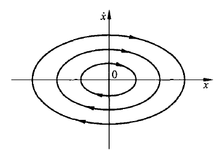
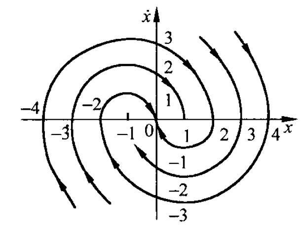
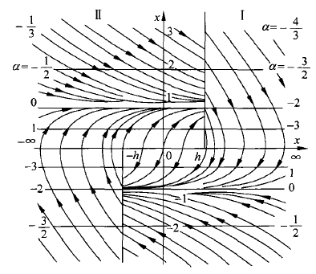
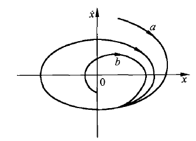
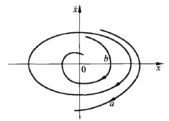
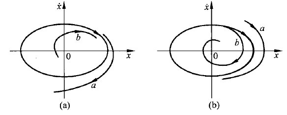
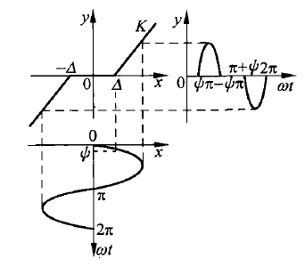

&ensp;
<!-- more -->

# 非线性控制系统概述
## 非线性现象的普遍性

组成实际控制系统的原不见总存在一定程度的非线性。例如，晶体管放大器有一个线性工作范围，超出这个范围，放大器就会出现饱和现象。
实际控制系统中，非线性因素广泛存在，线性系统模型只是在一定条件下忽略了非线性因素影响或进行了线性化处理的理想模型。

再用线性分析方法来研究这些系统性能，得出结果往往与实际情况相差很远。

由于非线性系统不满足叠加原理，必须寻求研究非线性控制系统的方法

## 控制系统中的典型非线性特性

### 饱和特性
只能在一定输入范围内保持输出和输入之间的线性关系，当输入超出该范围时，其输出限定为一个常值，饱和特性如图所示

图1 饱和特性

其数学表达式为
$$
y(t)=
\begin{cases}
K\cdot x(t)&(|x(t)|\leqslant a)\\
K\cdot a\cdot sgn(x(t))&(|x(t)|> a)
\end{cases}\tag{7.1}
$$

### 死区特性
只有在输入信号达到一定程度后才有输出。死区特性如图所示

图2 死区特性

其数学表达式为
$$
y(t)=
\begin{cases}
0 &(|x(t)|\leqslant \Delta)\\
K [x(t)-\Delta\cdot sgn(x(t))] &(|x(t)|> \Delta)
\end{cases}\tag{7.2}
$$

### 继电特性
由于继电器吸合及释放状态下磁路的磁阻不同，吸合与释放电压时不相同的。因此，继电器的特性有一个滞环，输入输出关系不完全是单值。继电特性如图所示

图3 三位置继电特性

其数学表达式为
$$
y(t)=
\begin{cases}
0 &(-mh< x(t)< h,\text{\.x}(t)>0)\\
0 &(-h< x(t)< mh,\text{\.x}(t)<0)\\
Msgn(x(t)) &(|x(t)|\geqslant h)\\
M &(x(t)\geqslant mh,\text{\.x}(t)<0)\\
-M &(x(t)\leqslant -mh,\text{\.x}(t)>0)
\end{cases}\tag{7.3}
$$

当$m=-1$时，典型继电特性退化成为纯滞环的两位置继电特性，特性曲线如图4的a，当$m=0$时，成为死区继电特性，如图4的b。当$h=0$时，成为理想继电特性，如图4的c。





图5 其他情况的继电特性

### 间隙特性
间隙的非线性特点是当输入量改变方向时，输出量不变，一直到输入量的变换超出一定数值（间隙消除）后，输入量才跟着变换。死区特性如图所示

图6 间隙特性特性

其数学表达式为
$$
\begin{cases}
y(t)=K[x(t)-bsgn(x(t))]  &(|{y(t)\over K}-x(t)|>b)\\
\text{\.y(t)=0}  & (|{y(t)\over K}-x(t)|<b)
\end{cases}\tag{7.4}
$$

## 非线性控制系统特点

### 不满足叠加原理
对于线性系统如果输入$x_1$的输出为$y_1$，输入$x_2$的输出为$y_2$，那么有$x=a_1x_1+a_2x_2$的情况下输出$y=a_1y_1+a_2y_2$。

但在非线性系统中，这种关系并不成立。
在线性系统中的系统运动特征与输入幅值、系统初始状态无关，故通常是在典型输入函数和零初始条件进行研究。
然而在非线性系统中，由于叠加原理不满足，因而不能应用线性系统的方法。

线性系统各串联环节位置可以相互交换，但在非线性系统中，非线性环节之间、非线性与线性环节之间位置一般不能交换。

### 稳定性
线性系统的稳定性仅取决于系统自身结构参数，与外作用大小、形式以及初始化条件无关。
非线性系统稳定性除了和自身结构参数有关外，还与外作用以及初始条件有关。非线性系统的平衡点可能不止一个，所以非线性系统的稳定性只对确定的平衡点讨论。
一个非线性系统在某些平衡点可能是稳定的，在另外一些平衡点可能是不稳定的，在小扰动可能稳定，大扰动却可能不稳定。

### 正弦响应

非线性系统在正弦信号作用下，系统的稳态输出的波形不仅与系统自身结构参数有关，还与输入信号的幅值大小相关，且输出信号中常常含有输入信号所没有的频率分量。因此频域分析法不适用于非线性系统。

### 自持振荡
描述线性系统的微分方程可能有一个周期运动解，但这一周期运动实际不能稳定持续。
例如二阶零阻尼系统自由运动解是$y(t)=A\sin(wt+\varphi)$。一旦系统受到扰动$A$和$\varphi$都会改变，这种周期运动是不稳定。

非线性系统，即使在没有输入作用的情况下，可有可能产生一定频率和振幅的周期运动。并且受到扰动后，运动仍能保持圆来的频率和振幅不变，即这种周期运动具有稳定性。非线性系统出现这种稳定的周期运动称为自持振荡。
自持振荡是非线性系统特有的运动现象，是非线性控制理论研究的重要问题之一。

## 非线性控制系统的分析方法
相平面分析法和描述函数法是工程上广泛应用的方法。
相平面分析法是一种用图解法求解二阶非线性常微分方程的方法。相平面轨迹描述了系统状态的变化过程，因此可以在相平面上分析平衡状态的稳定性和系统的时间响应特性。
描述函数法又称为谐波线性化法，是一种工程近似方法，可以用于研究一类非线性控制it的稳定性和自振问题。

# 相平面法
## 相平面概念
设一个二阶系统可以用微分方程
$$
\text{\"x}+f(x,\text{\.x})=0
$$
来描述。
取$x,\text{\.x}$构成坐标平面，称为相平面，则系统的每一个状态均对应于平面上的一点。当t变化时，这一点在相平面上绘出轨迹，表征系统状态的演变过程，该轨迹就叫做相轨迹。

## 相轨迹的性质

### 相轨迹的斜率
相轨迹在相平面上任意一点$(x,\dot x)$的斜率为

$$
{\text{d}\dot x\over \text{d}x}={\text{d}\dot x/\text{d}t\over \text{d}x/\text{d}t}=
{-f(x,\dot x)\over \dot x}\tag{7.5}
$$

只要在点$(x,\dot x)$处不同时满足$\dot x=0,f(x,\dot x)=0$，相轨迹的斜率就是一个确定的值，这样相轨迹不可能多余一条，相轨迹不会在该点相角。这些点时相平面上的普通点。

### 相轨迹的奇点
在相平面上同时满足$\dot x=0$和$f(x,\dot x)=0$，相轨迹的斜率
$$
{\text{d}\dot x\over \text{d}x}={-f(x,\dot x)\over \dot x}={0\over 0}
$$

即相斜率不确定，通过该点的相轨迹有一条以上。这些点是相轨迹的交点，称为奇点，显然，奇点只分布在x轴上。由于在奇点处$\ddot x=\dot x=0$，故奇点也称为平衡点。

### 相轨迹的运动方向
相平面上半平面$\dot x>0$，相轨迹向x轴正方向移动，同理下半平面$\dot x<0$，相轨迹箭头向左。
因此相轨迹点在相平面上总是按顺时针方向运动。

### 相轨迹通过x轴的方向
相轨迹总是以垂直方向穿过x轴。因为在x轴上所有点均满足$\dot x=0$，因而除去其中$f(x,\dot x)=0$的奇点外，，在其他点上的斜率$\text{d}\dot x/\text{d}x\to \infty$，这表示相轨迹与相平面的x轴是正交的。

## 相轨迹的绘制

### 解析法
当描述系统的微分方程比较简单时，适合于用解析法绘制相轨迹。
设系统的微分方程为
$$
\ddot x+2\zeta w_n\dot x+w_n^2x=0
$$
在一组非全零初始条件下运动，当$\zeta=0$有
$$
\ddot x+w_n^2x=0
$$

考虑到
$$
\ddot x={\text{d}\dot x\over \text{d}x}{\text{d}x\over \text{d}t}=
\dot x\cdot{\text{d}\dot x\over \text{d}x}=-w_n^2x
$$

用分离变量进行积分有
$$
\dot x\text{d}\dot x=-w_n^2x\text{d}x\\
\int \dot x \text{d}\dot x=
-w_n^2\int x\text{d}x\\
x^2+{\dot x^2\over w_n^2}=A^2
$$

其中，A是由初始条件$(x_0,\dot x_0)$决定的常数。上式表示相平面上以$(x_0,\dot x_0)$为起始点的椭圆族，如下图所示，表明系统的响应时等幅周期运动。

图7 零阻尼二阶系统的相平面图

### 图解法

等倾斜线法是一种通过图解方法求相轨迹的方法，由式7.5可求得相平面上某点处的相轨迹斜率
$$
{\text{d}\dot x\over \text{d}x}={-f(x,\dot x)\over \dot x}
$$

若令斜率为常数$\alpha$，则可写成
$$
\alpha = {-f(x,\dot x)\over \dot x}\tag{7.6}
$$

很明显，在相平面中，经过等倾斜线上各点的相轨迹斜率都等于$\alpha$，给定不同的$\alpha$值，可在相平面上绘制相应的等倾斜线。
在各等倾斜线做出斜率为$\alpha$的短线段，就可以得到相轨迹切线的方向场。沿方向场画连续曲线可以绘制相平面图。

设系统的微分方程为
$$
\dot x +\dot x+x=0
$$

那么有
$$
\dot x {\text{d}\dot x\over \text{d}x}=-(x+\dot x)
$$

则可得等倾斜线方程为
$$
\dot x={-x\over 1+\alpha}
$$

则可得到下表
$$
\begin{array}{c|c|c|c|c|c|c|c|c|c}
\hline
\alpha&-6.68&-3.75&-2.73&-2.19&-1.84&-1.58&-1.36&-1.18&-1.00\\
\hline
\displaystyle{-1\over1+\alpha}&0.18&0.36&0.58&0.84&1.19&1.73&2.75&5.67&\infty\\
\hline
\beta&10\degree&20\degree&30\degree&40\degree&50\degree&60\degree&70\degree&80\degree&90\degree\\
\hline
\hline
\alpha&-0.82&-0.64&-0.42&-0.16&0.19&0.73&1.75&4.68&\infty\\
\hline
\displaystyle{-1\over1+\alpha}&-5.76&-2.75&-1.73&-1.19&-0.84&-0.58&-0.36&-0.18&0 \\
\hline
\beta&100\degree&110\degree&120\degree&130\degree&140\degree&150\degree&160\degree&170\degree&180\degree
\end{array}
$$

## 由相轨迹求时间解
相轨迹能清楚反映系统的运动特性。而由相轨迹确定系统的响应时间、周期运动的周期以及过渡时间会设计相轨迹求时间信息的问题。这里介绍增量法。

设系统的相轨迹图如图所示

图8 零阻尼二阶系统的相平面图

系统在$t_A$时刻系统状态位于$A(x_A,\dot x_A)$经过时间$\Delta t_{AB}$后系统状态移动到位置B，那么可得平均速度
$$
\dot x_{AB}={x_B-x_A\over \Delta t_{AB}}
$$

又由
$$
\dot x_{AB}={\dot x_A+\dot x_B\over 2}
$$

那么可求出A到B的时间
$$
\Delta t_{AB}={2(x_B-x_A)\over \dot x_A+\dot x_B}
$$

注意在穿过x轴的相轨迹进行计算时，最好将一点选在x轴上，避免$\dot x_{AB}=0$

## 二阶线性系统的相轨迹

许多本质性非线性系统常常可以进行分段线性化处理，而许多本质性非线性系统也可以在平衡点附近作增量线性化处理，因此可以从二阶线性系统的相轨迹入手进行研究。

设二阶线性系统自由运动的微分方程为

$$
\ddot x+2\zeta w_n\dot x+w_n^2x=0
$$

可得
$$
{\text{d}\dot x\over \text{d}x}=
-{w_n^2x+2\zeta w_n \dot x\over \dot x}
$$

利用等倾斜线法将不同情形下二阶线性系统相平面归纳整理如下

若令$\ddot x=\dot x=0$，可以得出唯一解$x_e=0$，这表明线性二阶系统的奇点就是相平面原点。
根据系统极点在复平面上的位置分布，以及相轨迹的形状，将奇点分为不同的类型。

1. 当$\zeta\geq1$，$\lambda_1,\lambda_2$为两个负实根，系统处于过阻尼或临界阻尼状态，自由响应按指数衰减。对应的相轨迹是一簇趋向相平面原点的抛物线，相应奇点称为稳定的节点。

2. 当$0<\zeta <1$，$\lambda_1,\lambda_2$为一对具有负实部的共轭复根，系统处于欠阻尼状态，自由响应为衰减振荡过程。对应的相轨迹是一簇收敛对数螺旋线，相应奇点称为稳定的焦点。

3. 当$\zeta=0$，$\lambda_1,\lambda_2$为共轭纯虚根，系统自由响应为简谐运动。对应的相轨迹是一簇同心椭圆，相应奇点称为中心点。

4. 当$-1<\zeta<0$，$\lambda_1,\lambda_2$为两个具有正实根的共轭复根，系统自由响应为非周期发散状态。对应的相轨迹是发散的对数螺旋线簇，相应奇点称为不稳定的节点。

5. 当$\zeta<-1$，$\lambda_1,\lambda_2$为两个正实根，系统自由响应呈现非周期发散状态。对应的相轨迹是发散的抛物线簇，相应奇点称为不稳定的焦点。

6. 若极点$\lambda_1,\lambda_2$为两个符号相反的实根，系统自由响应为非周期发散状态。对应的相轨迹是一簇双曲线，相应奇点称为鞍点，是不稳定的平衡点。

## 非线性系统的相平面分析

### 非本质非线性系统的相平面分析

如果描述非线性系统的微分方程中，函数$f(x,\dot x)$是解析的，则可在平衡点出将其进行小偏差线性化近似，然后按二阶线性系统分析奇点类型，确定系统在该点的稳定性。

设系统的微分方程为
$$
\ddot x -(1-x^2)\dot x +x-x^2=0
$$

则有系统的平衡点为
$$
x_{e1}=0,x_{e2}=1
$$

分别在各平衡点处对系统进行线性化处理，当$x=x_{e1}$
$$
\Delta\ddot x-\Delta\dot x+\Delta x=0
$$

特征根为
$$
\lambda_{1,2}={1\over 2}\pm \text{j}{\sqrt{3}\over 2}
$$

同理当$x=x_{e2}$得出线性化方程为
$$
\Delta\ddot x-\Delta x=0
$$

相应的特征根为
$$
\lambda_1=-1,\lambda_2=1
$$

平衡点$x_{e2}=1$为鞍点。

### 本质非线性系统的相平面分析
许多非线性系统所含有的非线性特性是分段线性的，或者可以用分段线性特性来近似。
用相平面法分析这类问题，一般采用“分区-衔接”的方法。首先根据非线性特性的线性分段情况，用几条分界线（开关线）把相平面分成几个线性区域，在各线性区域内，分别用线性微分方程来描述。其次分别绘出各区域的相平面图，最后将相邻区域的相轨迹衔接成连续曲线，即可获得系统的相平面图。

设系统的微分方程为
$$
\ddot x+x+\text{sgn}\dot x=0\\
$$

系统方程可写为
$$
\begin{cases}
\ddot x+x+1=0,&(\dot x>0,\rm I区)\\
\ddot x+x=0,&(\dot x=0,\rm x轴)\\
\ddot x+x-1=0,&(\dot x<0,\rm II区)\\
\end{cases}
$$

系统奇点
$$
\rm I:x_{e1}=-1 \qquad
\rm II : x_{e2}=1
$$

系统特征方程、特征根为
$$
s^2+1=0,s_{1,2}=\pm\rm j
$$

极点为中心点，相平面图如下所示

图9 相平面图

### 非线性控制系统的相平面分析
对于用结构图形式表示的非线性控制系统，首先要根据线性环节、非线性环节以及比较点分别列些回路上各个变量之间的数学关系式，然后经过代换消去之间变量，导出以相变量描述的系统方程，最后用本质非线性系统的相平面分析方法进行处理。

若有系统结构图如图所示

图10 非线性系统结构图

对线性环节有
$$
{C(s)\over U(s)}={K\over s(Ts+1)}
$$

得出以x为变量的系统微分方程

$$
T\ddot x+\dot x=-Ku
$$

对非线性环节有

$$
u=
\begin{cases}
M
\begin{cases}
x>h\\
x>-h,\dot x<0
\end{cases}
\text{I}区
\\
-M
\begin{cases}
x<-h\\
x<h,\dot x>0
\end{cases}
\text{II}区
\end{cases}
$$

带入微分方程有
$$
\text{I}: T\ddot x+\dot x=-KM
\begin{cases}
x>h\\
x>-h,\dot x<0
\end{cases}\\
\text{II}:
T\ddot x+\dot x=KM
\begin{cases}
x<-h\\
x<h,\dot x>0
\end{cases}
$$

可得等倾斜线方程为
$$
\text{I}:\dot x={-KM\over T\alpha+1}\\
\text{II}:\dot x={KM\over T\alpha+1}
$$

计算后得下表

采用等倾斜宪法绘制出系统相平面如图

图11 系统的相平面图

由图可知系统运动最终趋向一条封闭的相轨迹，称之为极限环，它对应系统的一种稳定的周期运动，即自振。

极限环是非线性系统在相平面上的一条封闭的特殊相轨迹，它将相轨迹分成环内、环外两部分。
极限环分为三种类型：稳定的、不稳定的和半稳定的。
自振对应的是一个稳定的极限环

#### 稳定的极限环
如果极限环内部和外部的相轨迹都逐渐向它逼近，则这样的极限环称为稳定的极限环。对应系统的自振运动。

图12 稳定的极限环

#### 不稳定的极限环
如果极限环内部和外部的相轨迹都逐渐远离它而去，则这样的极限环称为不稳定的极限环。

图13 不稳定的极限环

#### 稳定的极限环
如果极限环内部的相轨迹都逐渐向它逼近，而外部的相轨迹逐渐远离它而去，或者，内部的相轨迹都逐渐远离它而去，而外部的相轨迹逐渐向它逼近。则这样的极限环称为半稳定的极限环。具有这种极限环的系统不会产生自振，系统的运动趋向发散或收敛。

图14 半稳定的极限环

非线性控制系统可能没有极限环，也可能有一个或多个极限环。

# 描述函数法

描述函数法主要用来分析在没有输入信号作用时，一类非线性系统的稳定性和自振问题，这种方法不受系统阶次的限制，但有一定的近似性。
另外，描述函数法只能用于研究系统的频率响应特性。不能给出时间响应的确切信息。

## 描述函数的基本概念

设非线性环节在正弦信号$x = A\sin wt$作用下，其输出$y(t)$一般都是非正弦周期信号。把$y(t)$展开成傅里叶级数

$$
y(t)=A_0+\sum_{n=1}^\infty (A_n\cos nwt+B_n\sin nwt)=
A_0+\sum_{n=1}^\infty Y_n\sin(nwt+\varphi_n)
$$

式中
$$
A_n={1\over \pi}\int_0^{2\pi}y(t)\cos nwt\text{d}(wt)\\
B_n={1\over \pi}\int_0^{2\pi}y(t)\sin nwt\text{d}(wt)\\
Y_n=\sqrt{A_n^2+B_n^2}\\
\varphi_n=\arctan{A_n\over B_n}
$$

若非线性特性时中心对称的，则$y(t)$具有奇次对称性，此时$A_0=0$，输出$y(t)$中基波分量为
$$
y_1(t)=A_1\cos wt+B_1\sin wt=Y_1\sin(wt+\varphi_1)
$$

描述函数定义为非线性环节稳态正弦响应中的基波分量输入正弦信号的复数比
$$
N(A)={Y_1\over A}e^{\rm j\varphi_1}={B_1\over A}+\rm j{A_1\over A}
$$

式中，$Y_1$为非线性环节输出信号中基波分量的振幅；A为输入正弦信号的振幅。$\varphi_1$为非线性环节输出信号中基波分量与输入正弦信号的相角差。

很明显，非线性特性的描述函数时线性系统频率特性概念的推广。
利用描述函数的概念，在一定条件下借用线性系统频域分析方法来分析系统的稳定性和自振运动。

描述函数的定义中，只考虑非线性环节输出中基波分量来描述其特性，而忽略了高次谐波的影响，这种方法称为谐波线性化。

谐波线性化本质上不同于小扰动线性化，线性环节的频率特性与输入正弦信号的幅值无关，而描述函数则是输入正弦信号振幅的函数。因此，描述函数只是形式上借用了线性系统频率响应的概念，而本质上保留了非线性的基本特征。

## 典型非线性特性的描述函数

### 饱和特性的描述函数

饱和特性及其在正弦信号$x(t)=A\sin wt$作用下输出的波形如下图所示

图15 饱和特性及其输入-输出波形

$$
y(t)=
\begin{cases}
KA\sin wt &0\leqslant wt\leqslant \phi_1\\
Ka &  \phi_1\leqslant wt\leqslant {\pi\over 2}
\end{cases}
$$

式中，K为线性部分斜率，a为线性区，$\phi_1=\arcsin {a\over A}$

由图可以看出$y(t)$是奇函数，且具有半波对称和1/4波对称的形状。则$B_1$可按下式计算

$$
\begin{aligned}
B_1=& {1\over \pi}\int_0^{2\pi}y(t)\sin wt \text{d}(wt)\\
=&{4\over \pi}\int_0^{\phi_1}KA\sin^2wt\text{d}(wt)+
{4\over\pi}\int_{\phi_1}^{\pi\over2}Ka\sin wt \text{d}(wt)\\
=&{2KA\over \pi}[\arcsin{a\over A}+{a\over A}\sqrt{1-({a\over A})^2}]
\end{aligned}
$$

则可得饱和特性的描述函数为

$$
N(A)={B_1\over A}={2K\over \pi}[\arcsin{a\over A}+{a\over A}\sqrt{1-({a\over A})^2}]
$$

可知饱和特性描述函数是一个与输入信号幅值A有关的实函数。

### 死区特性的描述函数

死区特性及其在正弦信号$x(t)=A\sin wt$作用下输出的波形如下图所示

图16 死区特性及其输入-输出波形

$$
y(t)=
\begin{cases}
0 &  0\leqslant wt \leqslant \phi\\
KA(\sin wt -\sin \phi) &\phi\leqslant wt\leqslant \pi-\phi\\
0 &  \pi-\phi\leqslant wt\leqslant \pi
\end{cases}
$$

式中，K为线性部分斜率，a为线性区，$\phi=\arcsin {\Delta\over A}$

由图可以看出$y(t)$是奇函数，且具有半波对称和1/4波对称的形状。则$B_1$可按下式计算

$$
\begin{aligned}
B_1=& {1\over \pi}\int_0^{2\pi}y(t)\sin wt \text{d}(wt)\\
=&{4\over \pi}\int_\phi^{\pi\over2}KA(\sin wt-\sin \phi)\sin wt \text{d}(wt)\\
=&{2KA\over \pi}[{\pi\over 2}-\arcsin ({\Delta\over A})-({\Delta\over A})\sqrt{1-({\Delta\over A})^2}]
\end{aligned}
$$

则可得饱和特性的描述函数为

$$
N(A)=
{2K\over \pi}[{\pi\over 2}-\arcsin ({\Delta\over A})-({\Delta\over A})\sqrt{1-({\Delta\over A})^2}]
$$

可知饱和特性描述函数是一个与输入信号幅值A有关的实函数。

### 继电特性的描述函数

继电特性及其在正弦信号$x(t)=A\sin wt$作用下输出的波形如下图所示

图15 饱和特性及其输入-输出波形

$$
y(t)=
\begin{cases}
KA\sin wt &0\leqslant wt\leqslant \phi_1\\
Ka &  \phi_1\leqslant wt\leqslant {\pi\over 2}
\end{cases}
$$

式中，K为线性部分斜率，a为线性区，$\phi_1=\arcsin {a\over A}$

由图可以看出$y(t)$是奇函数，且具有半波对称和1/4波对称的形状。则$B_1$可按下式计算

$$
\begin{aligned}
B_1=& {1\over \pi}\int_0^{2\pi}y(t)\sin wt \text{d}(wt)\\
=&{4\over \pi}\int_0^{\phi_1}KA\sin^2wt\text{d}(wt)+
{4\over\pi}\int_{\phi_1}^{\pi\over2}Ka\sin wt \text{d}(wt)\\
=&{2KA\over \pi}[\arcsin{a\over A}+{a\over A}\sqrt{1-({a\over A})^2}]
\end{aligned}
$$

则可得饱和特性的描述函数为

$$
N(A)={B_1\over A}={2K\over \pi}[\arcsin{a\over A}+{a\over A}\sqrt{1-({a\over A})^2}]
$$

可知饱和特性描述函数是一个与输入信号幅值A有关的实函数。
