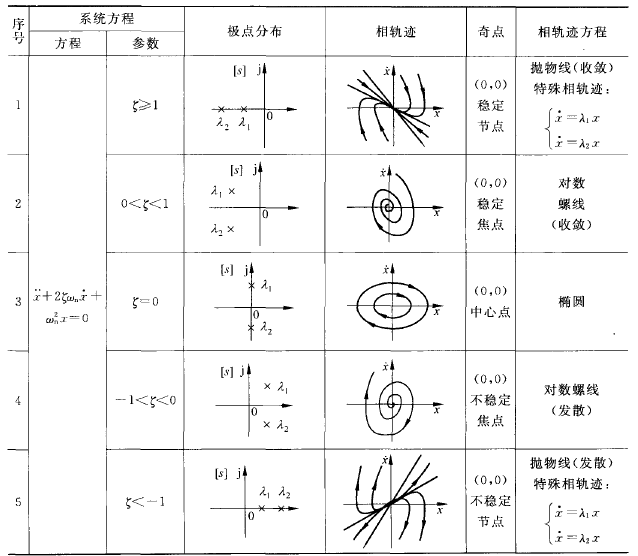
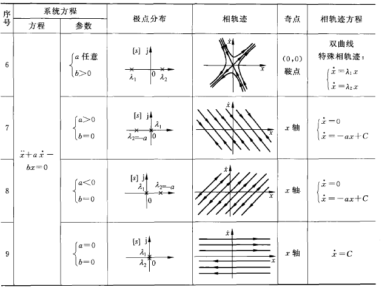

&ensp;
<!-- more -->

# 非线性控制系统概述
## 非线性现象的普遍性

组成实际控制系统的原不见总存在一定程度的非线性。例如，晶体管放大器有一个线性工作范围，超出这个范围，放大器就会出现饱和现象。
实际控制系统中，非线性因素广泛存在，线性系统模型只是在一定条件下忽略了非线性因素影响或进行了线性化处理的理想模型。

再用线性分析方法来研究这些系统性能，得出结果往往与实际情况相差很远。

由于非线性系统不满足叠加原理，必须寻求研究非线性控制系统的方法

## 控制系统中的典型非线性特性

### 饱和特性
只能在一定输入范围内保持输出和输入之间的线性关系，当输入超出该范围时，其输出限定为一个常值，饱和特性如图所示

图1 饱和特性

其数学表达式为
$$
y(t)=
\begin{cases}
K\cdot x(t)&(|x(t)|\leqslant a)\\
K\cdot a\cdot sgn(x(t))&(|x(t)|> a)
\end{cases}\tag{7.1}
$$

### 死区特性
只有在输入信号达到一定程度后才有输出。死区特性如图所示

图2 死区特性

其数学表达式为
$$
y(t)=
\begin{cases}
0 &(|x(t)|\leqslant \Delta)\\
K [x(t)-\Delta\cdot sgn(x(t))] &(|x(t)|> \Delta)
\end{cases}\tag{7.2}
$$

### 继电特性
由于继电器吸合及释放状态下磁路的磁阻不同，吸合与释放电压时不相同的。因此，继电器的特性有一个滞环，输入输出关系不完全是单值。继电特性如图所示

图3 三位置继电特性

其数学表达式为
$$
y(t)=
\begin{cases}
0 &(-mh< x(t)< h,\text{\.x}(t)>0)\\
0 &(-h< x(t)< mh,\text{\.x}(t)<0)\\
Msgn(x(t)) &(|x(t)|\geqslant h)\\
M &(x(t)\geqslant mh,\text{\.x}(t)<0)\\
-M &(x(t)\leqslant -mh,\text{\.x}(t)>0)
\end{cases}\tag{7.3}
$$

当$m=-1$时，典型继电特性退化成为纯滞环的两位置继电特性，特性曲线如图4的a，当$m=0$时，成为死区继电特性，如图4的b。当$h=0$时，成为理想继电特性，如图4的c。





图5 其他情况的继电特性

### 间隙特性
间隙的非线性特点是当输入量改变方向时，输出量不变，一直到输入量的变换超出一定数值（间隙消除）后，输入量才跟着变换。死区特性如图所示

图6 间隙特性特性

其数学表达式为
$$
\begin{cases}
y(t)=K[x(t)-bsgn(x(t))]  &(|{y(t)\over K}-x(t)|>b)\\
\text{\.y(t)=0}  & (|{y(t)\over K}-x(t)|<b)
\end{cases}\tag{7.4}
$$

## 非线性控制系统特点

### 不满足叠加原理
对于线性系统如果输入$x_1$的输出为$y_1$，输入$x_2$的输出为$y_2$，那么有$x=a_1x_1+a_2x_2$的情况下输出$y=a_1y_1+a_2y_2$。

但在非线性系统中，这种关系并不成立。
在线性系统中的系统运动特征与输入幅值、系统初始状态无关，故通常是在典型输入函数和零初始条件进行研究。
然而在非线性系统中，由于叠加原理不满足，因而不能应用线性系统的方法。

线性系统各串联环节位置可以相互交换，但在非线性系统中，非线性环节之间、非线性与线性环节之间位置一般不能交换。

### 稳定性
线性系统的稳定性仅取决于系统自身结构参数，与外作用大小、形式以及初始化条件无关。
非线性系统稳定性除了和自身结构参数有关外，还与外作用以及初始条件有关。非线性系统的平衡点可能不止一个，所以非线性系统的稳定性只对确定的平衡点讨论。
一个非线性系统在某些平衡点可能是稳定的，在另外一些平衡点可能是不稳定的，在小扰动可能稳定，大扰动却可能不稳定。

### 正弦响应

非线性系统在正弦信号作用下，系统的稳态输出的波形不仅与系统自身结构参数有关，还与输入信号的幅值大小相关，且输出信号中常常含有输入信号所没有的频率分量。因此频域分析法不适用于非线性系统。

### 自持振荡
描述线性系统的微分方程可能有一个周期运动解，但这一周期运动实际不能稳定持续。
例如二阶零阻尼系统自由运动解是$y(t)=A\sin(wt+\varphi)$。一旦系统受到扰动$A$和$\varphi$都会改变，这种周期运动是不稳定。

非线性系统，即使在没有输入作用的情况下，可有可能产生一定频率和振幅的周期运动。并且受到扰动后，运动仍能保持圆来的频率和振幅不变，即这种周期运动具有稳定性。非线性系统出现这种稳定的周期运动称为自持振荡。
自持振荡是非线性系统特有的运动现象，是非线性控制理论研究的重要问题之一。

## 非线性控制系统的分析方法
相平面分析法和描述函数法是工程上广泛应用的方法。
相平面分析法是一种用图解法求解二阶非线性常微分方程的方法。相平面轨迹描述了系统状态的变化过程，因此可以在相平面上分析平衡状态的稳定性和系统的时间响应特性。
描述函数法又称为谐波线性化法，是一种工程近似方法，可以用于研究一类非线性控制it的稳定性和自振问题。

# 相平面法
## 相平面概念
设一个二阶系统可以用微分方程
$$
\text{\"x}+f(x,\text{\.x})=0
$$
来描述。
取$x,\text{\.x}$构成坐标平面，称为相平面，则系统的每一个状态均对应于平面上的一点。当t变化时，这一点在相平面上绘出轨迹，表征系统状态的演变过程，该轨迹就叫做相轨迹。

## 相轨迹的性质

### 相轨迹的斜率
相轨迹在相平面上任意一点$(x,\dot x)$的斜率为

$$
{\text{d}\dot x\over \text{d}x}={\text{d}\dot x/\text{d}t\over \text{d}x/\text{d}t}=
{-f(x,\dot x)\over \dot x}\tag{7.5}
$$

只要在点$(x,\dot x)$处不同时满足$\dot x=0,f(x,\dot x)=0$，相轨迹的斜率就是一个确定的值，这样相轨迹不可能多余一条，相轨迹不会在该点相角。这些点时相平面上的普通点。

### 相轨迹的奇点
在相平面上同时满足$\dot x=0$和$f(x,\dot x)=0$，相轨迹的斜率
$$
{\text{d}\dot x\over \text{d}x}={-f(x,\dot x)\over \dot x}={0\over 0}
$$

即相斜率不确定，通过该点的相轨迹有一条以上。这些点是相轨迹的交点，称为奇点，显然，奇点只分布在x轴上。由于在奇点处$\ddot x=\dot x=0$，故奇点也称为平衡点。

### 相轨迹的运动方向
相平面上半平面$\dot x>0$，相轨迹向x轴正方向移动，同理下半平面$\dot x<0$，相轨迹箭头向左。
因此相轨迹点在相平面上总是按顺时针方向运动。

### 相轨迹通过x轴的方向
相轨迹总是以垂直方向穿过x轴。因为在x轴上所有点均满足$\dot x=0$，因而除去其中$f(x,\dot x)=0$的奇点外，，在其他点上的斜率$\text{d}\dot x/\text{d}x\to \infty$，这表示相轨迹与相平面的x轴是正交的。

## 相轨迹的绘制

### 解析法
当描述系统的微分方程比较简单时，适合于用解析法绘制相轨迹。
设系统的微分方程为
$$
\ddot x+2\zeta w_n\dot x+w_n^2x=0
$$
在一组非全零初始条件下运动，当$\zeta=0$有
$$
\ddot x+w_n^2x=0
$$

考虑到
$$
\ddot x={\text{d}\dot x\over \text{d}x}{\text{d}x\over \text{d}t}=
\dot x\cdot{\text{d}\dot x\over \text{d}x}=-w_n^2x
$$

用分离变量进行积分有
$$
\dot x\text{d}\dot x=-w_n^2x\text{d}x\\
\int \dot x \text{d}\dot x=
-w_n^2\int x\text{d}x\\
x^2+{\dot x^2\over w_n^2}=A^2
$$

其中，A是由初始条件$(x_0,\dot x_0)$决定的常数。上式表示相平面上以$(x_0,\dot x_0)$为起始点的椭圆族，如下图所示，表明系统的响应时等幅周期运动。

图7 零阻尼二阶系统的相平面图

### 图解法

等倾斜线法是一种通过图解方法求相轨迹的方法，由式7.5可求得相平面上某点处的相轨迹斜率
$$
{\text{d}\dot x\over \text{d}x}={-f(x,\dot x)\over \dot x}
$$

若令斜率为常数$\alpha$，则可写成
$$
\alpha = {-f(x,\dot x)\over \dot x}\tag{7.6}
$$

很明显，在相平面中，经过等倾斜线上各点的相轨迹斜率都等于$\alpha$，给定不同的$\alpha$值，可在相平面上绘制相应的等倾斜线。
在各等倾斜线做出斜率为$\alpha$的短线段，就可以得到相轨迹切线的方向场。沿方向场画连续曲线可以绘制相平面图。

设系统的微分方程为
$$
\dot x +\dot x+x=0
$$

那么有
$$
\dot x {\text{d}\dot x\over \text{d}x}=-(x+\dot x)
$$

则可得等倾斜线方程为
$$
\dot x={-x\over 1+\alpha}
$$

则可得到下表
$$
\begin{array}{c|c|c|c|c|c|c|c|c|c}
\hline
\alpha&-6.68&-3.75&-2.73&-2.19&-1.84&-1.58&-1.36&-1.18&-1.00\\
\hline
\displaystyle{-1\over1+\alpha}&0.18&0.36&0.58&0.84&1.19&1.73&2.75&5.67&\infty\\
\hline
\beta&10\degree&20\degree&30\degree&40\degree&50\degree&60\degree&70\degree&80\degree&90\degree\\
\hline
\hline
\alpha&-0.82&-0.64&-0.42&-0.16&0.19&0.73&1.75&4.68&\infty\\
\hline
\displaystyle{-1\over1+\alpha}&-5.76&-2.75&-1.73&-1.19&-0.84&-0.58&-0.36&-0.18&0 \\
\hline
\beta&100\degree&110\degree&120\degree&130\degree&140\degree&150\degree&160\degree&170\degree&180\degree
\end{array}
$$

## 由相轨迹求时间解
相轨迹能清楚反映系统的运动特性。而由相轨迹确定系统的响应时间、周期运动的周期以及过渡时间会设计相轨迹求时间信息的问题。这里介绍增量法。

设系统的相轨迹图如图所示

图8 零阻尼二阶系统的相平面图

系统在$t_A$时刻系统状态位于$A(x_A,\dot x_A)$经过时间$\Delta t_{AB}$后系统状态移动到位置B，那么可得平均速度
$$
\dot x_{AB}={x_B-x_A\over \Delta t_{AB}}
$$

又由
$$
\dot x_{AB}={\dot x_A+\dot x_B\over 2}
$$

那么可求出A到B的时间
$$
\Delta t_{AB}={2(x_B-x_A)\over \dot x_A+\dot x_B}
$$

注意在穿过x轴的相轨迹进行计算时，最好将一点选在x轴上，避免$\dot x_{AB}=0$

## 二阶线性系统的相轨迹

许多本质性非线性系统常常可以进行分段线性化处理，而许多本质性非线性系统也可以在平衡点附近作增量线性化处理，因此可以从二阶线性系统的相轨迹入手进行研究。

设二阶线性系统自由运动的微分方程为

$$
\ddot x+2\zeta w_n\dot x+w_n^2x=0
$$

可得
$$
{\text{d}\dot x\over \text{d}x}=
-{w_n^2x+2\zeta w_n \dot x\over \dot x}
$$

利用等倾斜线法将不同情形下二阶线性系统相平面归纳整理如下

